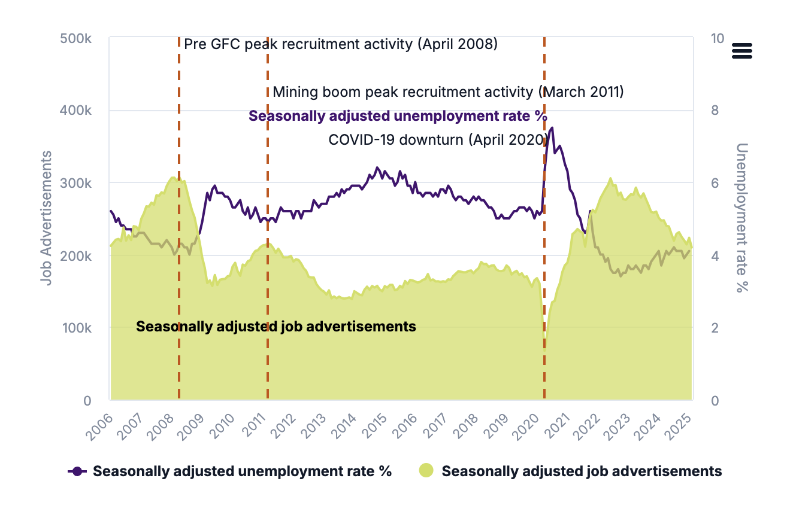
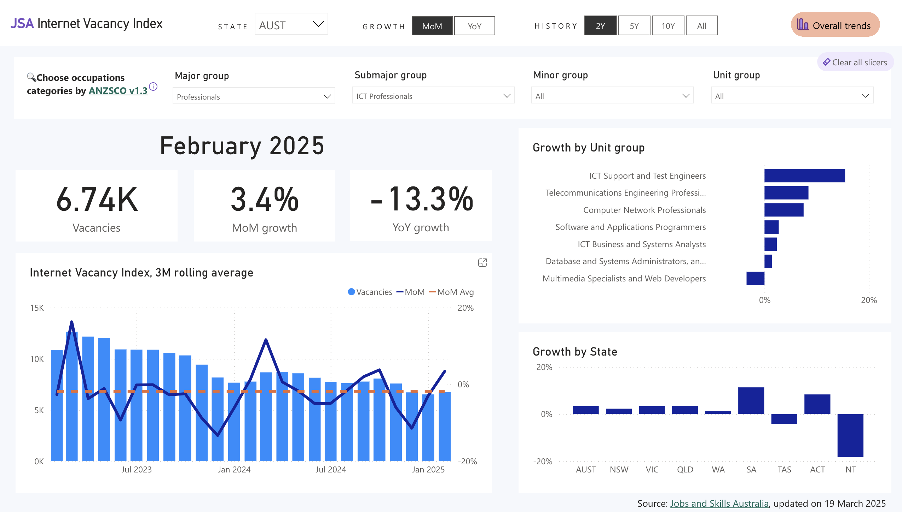

#### Job advertisements tumble online amid job market normalisation 

The [**Internet Vacancy Index**](https://www.jobsandskills.gov.au/data/internet-vacancy-index), a monthly data series measuring online job advertisements in Australia, is one of the many useful indicators that the good folks at Jobs and Skills Australia (JSA) publish.

Online job advertisements tumbled by 5.9% in February since January, on a seasonally adjusted basis, or down 15% from a year ago. This tracks with the general trend of the unemployment rate steadily rising towards "normal" levels from the post-pandemic trough. As JSA points out, job ads are still historically elevated.

To study the trends in online job ads, I created an interactive Power BI dashboard to the JSA's Internet Vacancy Index. It's a frontend to JSA's publicly available dataset so that you can easily view historical trends and filter by state, month, and occupation.

Below is an embded Power BI dashboard:

<iframe title="ivi" width="600" height="373.5" src="https://app.powerbi.com/view?r=eyJrIjoiNzIzNTU0ZDktOGZjOC00NDdjLTg3NjItMGFlOWE4MzEzYWU4IiwidCI6IjA0Y2EyZDBiLTliZmItNDQyYS05MmQwLTEwZTQ0MDQzZjNlNCJ9&pageName=Overall" frameborder="0" allowFullScreen="true"></iframe>

&nbsp;Press the full screen button on the bottom right.

For example, in contrast to the overall figure, online job advertisements for ICT Professionals rose in February over a month ago in all states except for Tasmania and the Northern Territory. The strongest growth was for ICT Support and Test Engineers (up 15.5%), while Multimedia Specialists and Web Developers felt a 3.4% fall.

