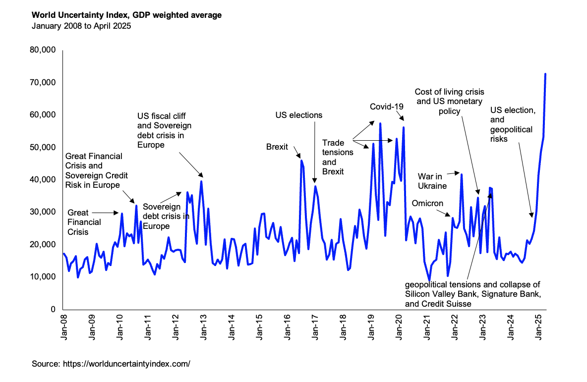
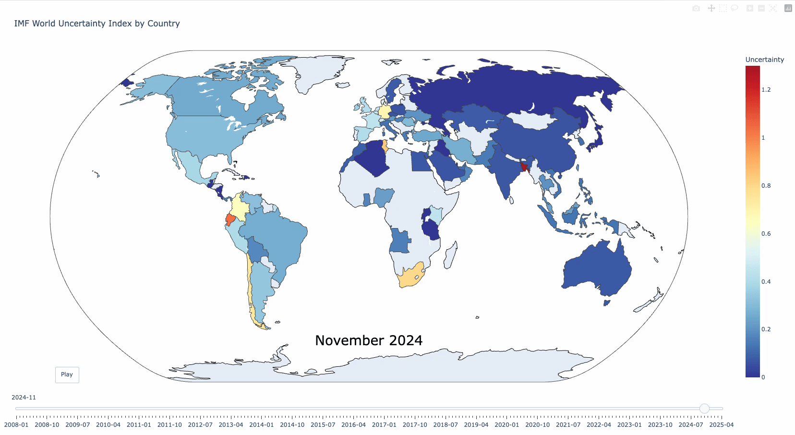

🌍 Global uncertainty has surged to record highs—eclipsing even the COVID-19 peak.

According to the IMF’s World Uncertainty Index, uncertainty jumped 37% in April following the U.S.’s sweeping tariff measures. Liberation Day unrest sent shockwaves through global equity and bond markets. Since November, the GDP-weighted index has tripled! 🤯

While new trade deals may help ease tensions, one trend is clear: the economic "decoupling" between the U.S. and China continues to gather pace.

Interesting times ahead for global trade, markets, and supply chains.

