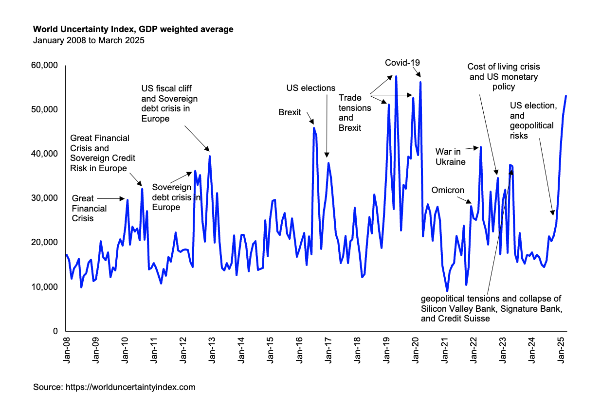
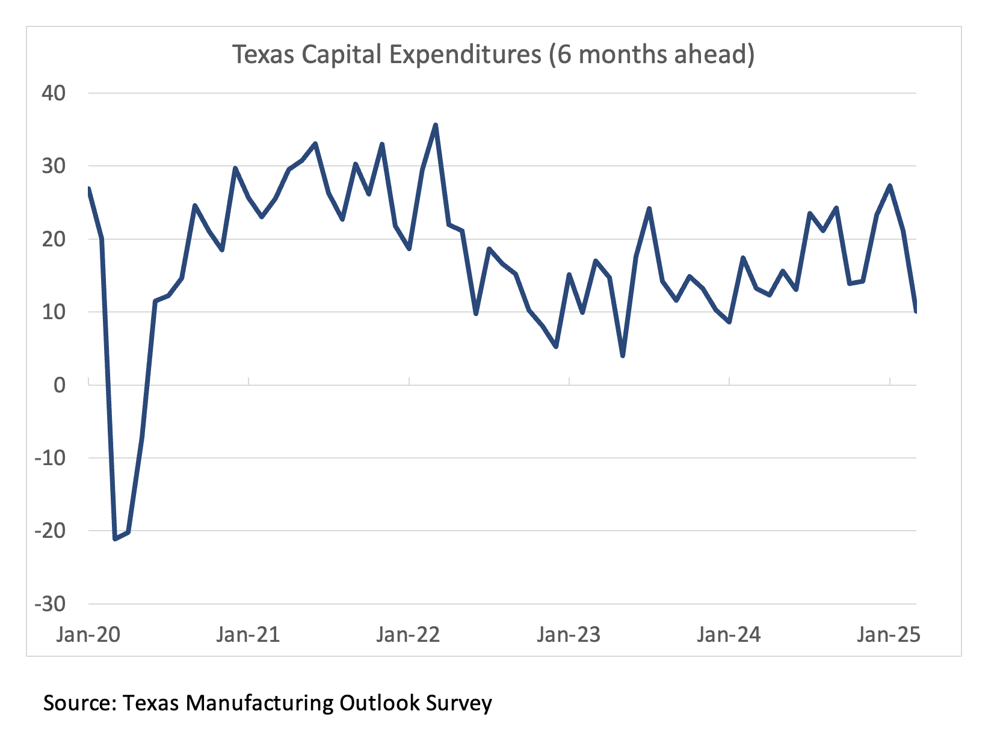

The IMF’s World Uncertainty Index climbed higher for the sixth straight month in March, reflecting growing unease around global tariff developments. We're now within reach of the levels of uncertainty seen during the depths of the COVID-19 pandemic. With the scope of the Liberation Day tariffs turning out broader and deeper than many had expected, there’s a good chance uncertainty could continue climbing in April 📈.

Despite the America-first framing 🇺🇸, the tariffs may struggle to meaningfully boost domestic manufacturing. Building new plants often involves billions in investment and long lead times—hardly ideal in an environment where policy signals are mixed and the diplomatic approach appears erratic 🤷. There’s also the question of how trading partners might respond, and whether rising input costs could ultimately weigh on local industries 🏭.

A recent survey of capital expenditure plans in Texas hints that tariffs may be having unintended consequences. In March, sentiment for six-month-ahead investment recorded its steepest drop in three years 📉.

The Fed could come under pressure to cut rates—ironically during what was supposed to be a period of policy normalisation—in order to support employment amid weakening investment sentiment. Compared to the China-focused tensions during Trump’s first term, the current measures are more far-reaching. This time, it may be harder for China to sidestep tariffs by redirecting exports through neighbouring countries.

Still, monetary policy can only do so much. It does in no way resolve the root cause of the issue: policy uncertainty. If anything, easing rates in response could unintentionally encourage further escalations in the trade war and creating even more inflationary pressure down the line 🔥.

#GlobalEconomy #TradeWar #Tariffs #FedWatch #MonetaryPolicy
