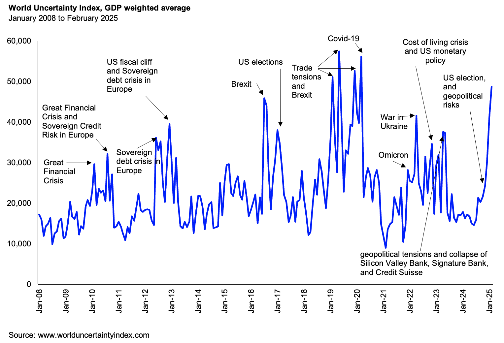

Pugilism has replaced diplomacy as erratic tit-for-tat America-first trade policies and countermeasures create a storm of uncertainty 🌩️ across the globe 🌍. This trade uncertainty inevitably spills over into other parts of the economy. The US dollar 💵 strengthens in uncertain times, exacerbating imported inflation 📈 and raising the cost of foreign borrowing in other countries. Meanwhile, reactionary policies become normalised by governments worldwide, and geopolitical risks escalate ⚠️.

The IMF’s World Uncertainty Index—which tracks global uncertainty by text-mining country reports from the Economist Intelligence Unit—underscores the precariousness of the situation. Weighted by GDP, the index has reached its highest level in five years, surpassing levels seen during Brexit, the European sovereign debt crisis, and the global financial crisis.

The worst part? The data only covers up to the end of February, meaning uncertainty could soon surpass even the levels seen during COVID-19.